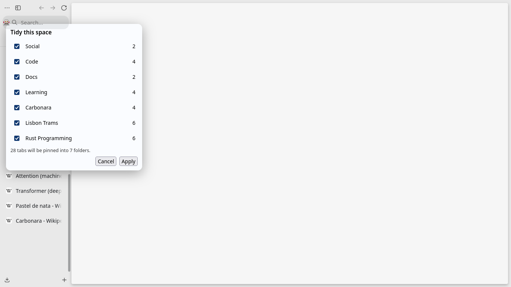

# Zen Tidy

Press **Alt+Shift+T** and your loose tabs become a few named, collapsed Zen folders. Nothing moves until you say so, and one click puts everything back.



## What it does

1. Matches loose tabs to folders you already have (a folder name word in the title, or a site that makes up most of the folder).
2. Applies your domain rules, then built-in buckets (Code, Docs, Video, Social, Mail & Calendar).
3. Groups whatever is left by topic with **Firefox's on-device AI** and names each group. No API key, and tab titles never leave your machine.
4. Puts the remaining tabs in an **Unsorted** folder (optional).
5. Shows a preview: rename, untick or drag one folder onto another to merge. Then **Apply**.

**Undo:** the toast after Apply has an Undo button (10 s), and the tab context menu has **Undo last Tidy** until you change one of the tidied tabs or folders. Undo returns every tab to its exact previous spot. No tab is ever closed.

## Install

Zen Tidy is a JavaScript mod, so it needs [Sine](https://github.com/CosmoCreeper/Sine) (Zen's built-in mod store only runs CSS mods).

1. Install Sine and restart Zen.
2. In Sine, install from `Serendeep/zen-extensions/zen-tidy`.
3. Restart Zen.

## First run

Zen ships with Firefox's AI engine switched off (`browser.ml.enable = false`). The first time you Tidy, the preview asks whether to turn it on. If you accept, Zen downloads the models once (about 15 s) and the next Tidy uses them. Until then, and whenever the AI takes longer than 5 seconds, Tidy works with rules only.

Turning **Use on-device AI** off in the settings only switches `browser.ml.enable` back off if Zen Tidy was the one that turned it on.

## Settings (Sine → Zen Tidy)

| Setting | Default |
|---|---|
| Use on-device AI | on |
| How eagerly AI groups tabs | Balanced (0.75) |
| Unsorted folder for leftovers | on |
| Domain rules, e.g. `github.com=Code; linear.app=Work` | empty |
| Shortcut (restart to apply) | Alt+Shift+T |

## Good to know

- **Tabs in folders are pinned** (that's how Zen folders work). Ctrl+W on a pinned tab unloads it instead of closing; use the tab's context menu to close it. Pinned tabs survive restarts and are skipped by "Close other tabs".
- Tidy only works in the current space, and only when one window shows that space.
- Essentials, already pinned tabs and tabs already in your folders are never touched (except tabs in Tidy's own Unsorted folder, which can move into a topic folder).
- If a Zen update breaks a function Tidy relies on, Tidy turns itself off and says which one. If only the AI part breaks, Tidy keeps working with rules.

## Development

```sh
cd zen-tidy
node --test        # pure logic in core.mjs
```

`core.mjs` holds every decision (matching, proposals, restore plans, guards) and has no browser globals. `zen-tidy.uc.mjs` reads Zen state, draws the preview and runs the plans.
